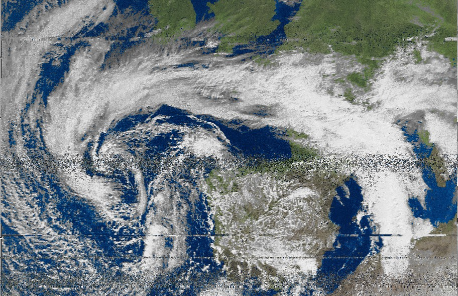
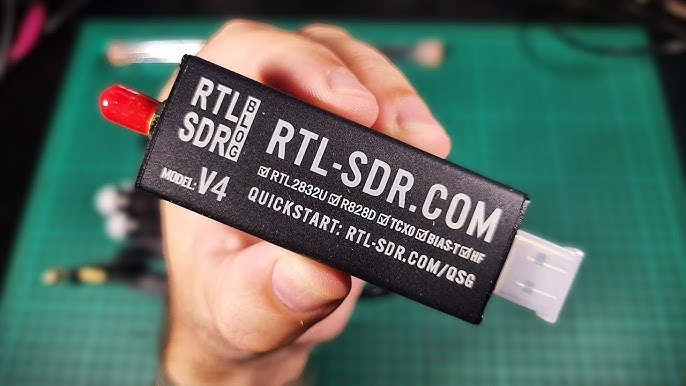
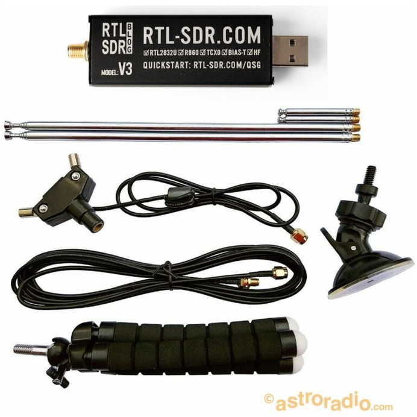
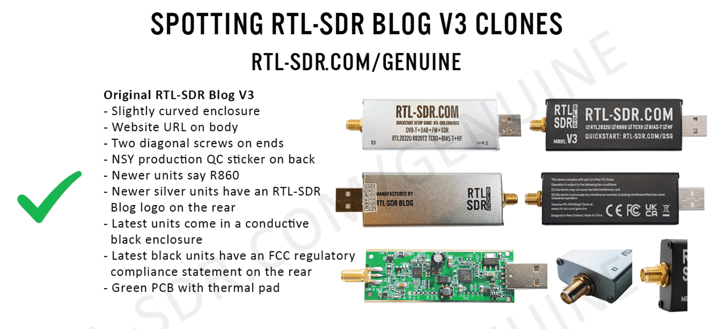
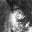

# Downloading Weather Images from NOAA satellites

## 1. Listening to the Universe

Did you know that satellites orbiting Earth are constantly broadcasting signals that anyone can receive with cheap, off-the-shelf hardware? This guide walks you through how to set up a simple RTL-SDR dipole antenna to capture real satellite imagery from NOAA weather satellites, receive image transmissions from the International Space Station (ISS), and explore what else is out there in the radio spectrum.

## 2. The RTL-SDR Receiver

The **RTL-SDR** is an inexpensive Software Defined Radio (SDR) dongle that was originally designed as a USB DVB-T television tuner. Hackers discovered that its chip (the RTL2832U) could be repurposed as a wideband radio receiver, and the SDR community was born.

### Key specs

| Feature | Details |
|---|---|
| Frequency range | 500 kHz – 1.75 GHz |
| Original purpose | DVB-T TV tuner |
| Software needed | SDR# (SDRSharp) or similar |
| Kit price (approx.) | ~€50 |

The starter kit includes the dongle itself plus a **dipole antenna** that can be adjusted and oriented for different frequency bands — perfect for the ~137 MHz range used by weather satellites.

> **Tip:** For VHF satellite reception (~137 MHz), extend each dipole arm to approximately **53 cm** (quarter-wavelength). Orient the antenna horizontally and point it towards the sky for best results.

## 3. Watch Out for Counterfeits

The RTL-SDR Blog brand (rtl-sdr.com) is widely cloned. Counterfeit units may look similar but often suffer from:

- Higher noise floor and interference
- Missing or non-functional HF/bias-tee circuits
- Cheaper PCBs without thermal pads
- No TCXO (temperature-compensated oscillator), causing frequency drift

**Official seller in Spain:** [astroradio.com](https://astroradio.com)

Always buy from the official store at [rtl-sdr.com/genuine](https://www.rtl-sdr.com/genuine) or from authorised resellers to ensure you get a quality unit.

## 4. What Can You Receive?

With the RTL-SDR and a dipole antenna you can pick up a surprisingly wide range of signals:

| Category | Examples |
|---|---|
| 🛰️ ISS | SSTV image events at 145.800 MHz |
| 🌤️ Weather satellites | NOAA APT media ~137.6 MHz, Meteor-M LRPT |
| 🔭 Radio astronomy | Galactic plane at 1420.4 MHz (hydrogen line) |
| ✈️ Radar & ADS-B | Aircraft transponders at 1090 MHz |

For this guide, we will focus on receiving data from **weather satellites**.

## 5. Weather Satellites: NOAA & METEOR

Two families of low Earth orbit (LEO) weather satellites broadcast imagery continuously — no special permission needed to receive them.

### 5.1. NOAA (USA) — APT

| Parameter | Value |
|---|---|
| Active satellites | NOAA-15, NOAA-18, NOAA-19 |
| Frequency | ~137.5–137.9 MHz (varies per satellite) |
| Mode | APT (Automatic Picture Transmission) |
| Signal | Easy to find — distinctive ticking sound |
| Decoding | WXTOIMG |

Common frequencies:
- NOAA-15: **137.620 MHz**
- NOAA-18: **137.9125 MHz**
- NOAA-19: **137.100 MHz**

### 5.2. METEOR-M (Russia) — LRPT

| Parameter | Value |
|---|---|
| Active satellite | Meteor M2-3 |
| Frequency | 137.100 MHz |
| Mode | LRPT (digital, higher resolution than APT) |
| Decoding | Requires additional steps & plugins (SatDump / LRPT decoder) |

> ⚠️ **Note:** Meteor LRPT requires more complex decoding software and careful timing. It is not covered in detail here — NOAA APT is the recommended starting point.

## 6. Understanding NOAA signals - Automatic Picture Transmission

APT is the analogue image transmission standard used by NOAA satellites. It was designed specifically to broadcast meteorological imagery and has been in continuous use since the 1960s.

**How APT works**

- media are transmitted **continuously** (not in discrete bursts like SSTV)
- Two image channels are sent simultaneously: **Channel A** (visible light) and **Channel B** (infrared / thermal)
- The signal sweeps one pixel-line at a time from top to bottom — the longer the pass, the more of the Earth you capture
- The characteristic "ticking" audio is the 2400 Hz sync carrier

**What you get**

A single satellite pass (typically 8–12 minutes overhead) produces an image strip showing a swath of the Earth's surface roughly **2,700 km wide**. The infrared channel is available day and night, while the visible channel only works in daylight.

## 7. Signal Capture software: SDR# + WXTOIMG

Two programs cover the main use-case described in this guide:

### 7.1 SDR# (SDRSharp)

The main receiver software. It connects to the RTL-SDR dongle, lets you tune to any frequency, adjusts filters and gain, and can record audio (baseband .wav files) for later decoding.

Download: [airspy.com/download](https://airspy.com/download/)

Basic SDR# setup for satellite reception:

1. Install the RTL-SDR drivers (use Zadig on Windows to install WinUSB).
2. Open SDR#, set source to **RTL-SDR USB**.
3. Set **Radio mode** to **WFM** (Wide FM) for NOAA/weather satellites.
4. Set bandwidth to around **34–40 kHz** for APT signals.
5. Tune to the satellite frequency (e.g. 137.620 MHz for NOAA 18).
6. Adjust **RF gain** — start at around 30–40 dB, avoid overloading.
7. Enable **Correct IQ** to reduce the centre spike.
8. Once the satellite pass begins, hit **Record** to save the audio.

### 7.2. WXTOIMG

Used to decode **APT (Automatic Picture Transmission)** from NOAA weather satellites. It can work with a live audio feed or a pre-recorded .wav file.

**Download (archived):** WXTOIMG is no longer actively developed, but can still be found at [wxtoimgrestored.xyz](https://wxtoimgrestored.xyz/)

Setup steps:

1. **Install WXTOIMG** and register it (free) for the full feature set.
2. Go to **Options → Ground Station Location** and enter your coordinates. This is needed for accurate map overlays and pass predictions.
3. Go to **Options → Recording Options** and set your sound card input.
4. Connect the audio output of SDR# to the audio input of WXTOIMG using a virtual audio cable (e.g. VB-Cable, free).

WXTOIMG can automatically apply false colour, add map overlays, calculate sea surface temperatures, and more.

## 8. Receiving NOAA 18 in Action

The video below show an actual reception of **NOAA 18** using SDR# and a simple RTL-SDR dipole antenna.

**Step 1 — Find the signal in SDR#**

As the satellite rises above the horizon, its signal appears in the waterfall display. The APT ticking is immediately visible as a rhythmic pattern in the spectrum.

  <video src="https://github.com/user-attachments/assets/55a419cd-10ed-475d-99b5-39190b00c170" title="Signal transmitted by NOAA" controls></video>

> The Doppler shift is noticeable: the signal appears slightly above the nominal frequency when the satellite is approaching, then drifts below it as it recedes. SDR# does not correct for this automatically — some operators tune manually during the pass.

**Step 2 — Record the audio**

Hit the record button in SDR# to save a WAV file of the pass. This can then be fed to WXTOIMG either live or after the fact.

**Step 3 — Decode with WXTOIMG**

WXTOIMG can decode in real time as the satellite passes overhead. As lines are received, the image builds up from top to bottom on screen.

Once you have a raw image, WXTOIMG can:

- Apply **false colour** (MCIR — Map Colour Infrared, MSA — Multi-Spectral Analysis, etc.)
- Overlay **map outlines** (coastlines, borders) using your ground station location
- Generate **temperature maps** from the infrared channel
- Produce **cloud-free composites** from multiple passes
- Export to PNG, JPEG, or other formats

The result for a NOAA-18 pass on **09/03/2025**:

You can clearly see cloud formations, coastlines, and the boundary between the Atlantic Ocean and the Iberian Peninsula. This image was received with nothing more than a €50 RTL-SDR kit and a simple dipole antenna.

## 9. ⚠️ 2025 Update: NOAA Decommissioning

**As of August 2025, all three classic NOAA APT satellites (NOAA-15, 18, and 19) have been decommissioned and are no longer transmitting.**

The satellites served for decades beyond their design lifetimes:

| Satellite | Service period | Days in service |
|---|---|---|
| NOAA-15 | 05/1998 – 08/2025 | ~9,961 |
| NOAA-18 | 05/2005 – 06/2025 | ~7,323 |
| NOAA-19 | 02/2009 – 08/2025 | ~6,033 |

This guide is preserved for historical and educational purposes. The workflow described (RTL-SDR + SDR# + WXTOIMG) remains valid and will apply to any future satellites that use APT or similar analogue transmission modes.

> 🔎 **Alternatives:** The Russian **Meteor-M2-3** satellite still transmits LRPT (digital) imagery on 137.100 MHz and can be decoded with **SatDump** — though with more complexity involved.

## 10. Resources & Links

| Resource | URL |
|---|---|
| RTL-SDR Blog (hardware) | [rtl-sdr.com](https://www.rtl-sdr.com) |
| Official Spain reseller | [astroradio.com](https://astroradio.com) |
| Genuine RTL-SDR check | [rtl-sdr.com/genuine](https://www.rtl-sdr.com/genuine) |
| SDR# download | [airspy.com/download](https://airspy.com/download/) |
| WXTOIMG (archived) | [wxtoimgrestored.xyz](https://wxtoimgrestored.xyz/) |
| MMSSTV | [mmhamsoft.amateur-radio.ca](http://www.mmhamsoft.amateur-radio.ca/) |
| ARISS (ISS SSTV events) | [ariss.org](https://www.ariss.org/) |
| Satellite tracking | [heavens-above.com](https://www.heavens-above.com/) |
| SatDump (Meteor/modern sats) | [github.com/SatDump/SatDump](https://github.com/SatDump/SatDump) |

*Presentation originally delivered in Catalan at the XX Jornada Astronòmica, 18 October 2025.*
